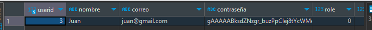

# Model (Modelos)

En este directorio tenemos los modelos en donde estaran las funciones que se encargaran de los distintos apartados que componen nuestra API.

## Usuarios

En usuarios tenemos 2 funciones las cuales son Registrar Usuarios y Iniciar Sesión ambas funcionan encriptando haciendo uso de la libreria Cryptography, DotEnv y Base64.

Esto para resguardar la seguridad de nuestros usuarios encriptando las contraseñas de todos nuestros usuarios, como veremos en el siguiente ejemplo.



Para esto si se quiere hacer uso debemos crear un archivo `.env` en el directorio de `./model` en el cual tendremos 2 valores los cuales seran `CLAVE_ENCRIPTACION` en donde tendremos que poner una clave de 32 bits, ejemplo:

```env
CLAVE_ENCRIPTACION=lR8L9Fl3fHJFAtouXSzMDxgge6nip88m
```

Y otra para la clave de los administradores del sitio web la cual también es de 32 bits, ejemplo:

```env
CLAVE_ADMINISTRACION=yko5yR238odXEKQEB0UvDcPbp6ncqslr
```

Es importante que cumpla con ser de 32 bits o Cryptography no podra usarla y dara multiples errores a lo largo del código.

Una vez tengamos crado nuestro archivo `.env` en `usuarios.py` tenemos como mencione anteriormente 2 funciones principales dentro de la clase `Usuarios`, las cuales son:

- registrarUsuario(nombre, correo, contraseña)
- iniciarSesion(correo, contrasena)

Y el funcionamiento es el siguiente:

### registrarUsuario(nombre, correo, contraseña)

En esta función lo primero que hacemos es llamar a una de las funciones en el código llamada `encriptar()`, la cual tiene dos parametros que son el `string` a encriptar y la clave de encriptación.

Por lo que quedaria de tal forma:

```python
contrasenaEncriptada = encriptar(contrasena, cargar_clave())

# contrasena = str y cargar_clave() es una función que extrae la clave del .env
```

De esta forma en la variable `contrasenaEncriptada` tendriamos la contraseña encriptada que enviariamos posteriormente a la base de datos pero para ello tendriamos que configurar la query.

```python
query = "INSERT INTO usuarios (nombre, correo, contraseña) VALUES (%s, %s, %s)"
parametros = nombre, correo, contrasenaEncriptada
```

En los parametros pondremos las variables que remplazaran a los valores de `%s`.

Posterior a esto nos vamos a conectar a la base de datos con la función de:

```python
# Nos conectamos a la base de datos
connection.conectar()
# Enviamos la Query y almacenamos el resultado de la query
resultado = connection.consultaDB(query, 1, parametros)
# Nos desconectamos de la base de datos
connection.desconectar()
# Y retornaremos el resultado que nos de la Consulta a la BD
return resultado
```

### iniciarSesion(correo, contraseña)

Este funciona de una forma similar asi que para explicarlo lo haré de una forma más breve.

```python
# Creamos la Query que buscara el correo
query = "SELECT * FROM usuarios WHERE correo = %s"
# Los parametros (solo sera el correo)
parametros = (correo,)
# Nos conectamos a la base de datos
connection.conectar()
# Inicializamos la variable contrasenaValida que es un booleano
contrasenaValida = False
# Hacemos la consulta para encontrar el usuario que corresponda al correo.
resultado = connection.consultaDB(query, 2, parametros)
# Desencriptamos la contraseña para compararla con la que introdujo el usuario
contrasenaDesencriptada = desencriptar(resultado[0][3], cargar_clave())
# Comparamos las claves
if str(contrasenaDesencriptada, "utf8") == contrasena:
    contrasenaValida = True
else:
    contrasenaValida = False
return contrasenaValida
```
